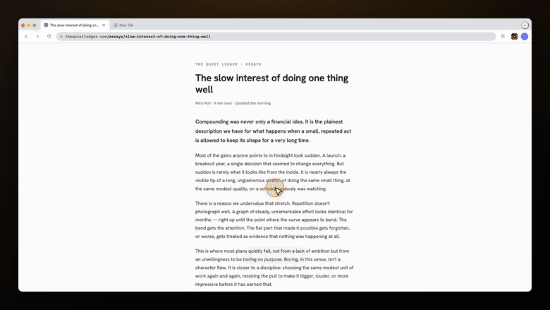

<div align="center">

```
██████╗ ███████╗███╗   ███╗ ██████╗     ██████╗ ███████╗███████╗██╗
██╔══██╗██╔════╝████╗ ████║██╔═══██╗    ██╔══██╗██╔════╝██╔════╝██║
██║  ██║█████╗  ██╔████╔██║██║   ██║    ██████╔╝█████╗  █████╗  ██║
██║  ██║██╔══╝  ██║╚██╔╝██║██║   ██║    ██╔══██╗██╔══╝  ██╔══╝  ██║
██████╔╝███████╗██║ ╚═╝ ██║╚██████╔╝    ██║  ██║███████╗███████╗███████╗
╚═════╝ ╚══════╝╚═╝     ╚═╝ ╚═════╝     ╚═╝  ╚═╝╚══════╝╚══════╝╚══════╝
```

### Script it. Record it. Smooth as butter.

Frame-exact **60 fps** demo videos of any web app, recorded from a short script — cursor halo, click ripples, captions, before/after badges.

<br/>



<sub>A 27 s promo for <a href="https://www.web2audio.com">Web2Audio</a> — three scenarios, one <code>build.sh</code>, zero screen recording.</sub>

<br/><br/>

[](https://hasuwini77.github.io/demo-reel/)&nbsp;
[](https://agentskills.io)&nbsp;
[](LICENSE)

<sub>Claude Code · Cursor · Codex · Gemini CLI · GitHub Copilot · 50+ more</sub>

</div>

---

> Every frame is stepped on a virtual clock, not captured off a live paint. However slow the page renders, the video plays back perfectly smooth.

## Install

```bash
npx skills add hasuwini77/demo-reel
```

`npx skills add` detects which agents you have and drops the skill in the right folder for each.

<details>
<summary>Claude Code plugin install</summary>

```bash
# terminal
claude plugin marketplace add hasuwini77/demo-reel
claude plugin install demo-reel@demo-reel

# or inside a Claude Code session
/plugin marketplace add hasuwini77/demo-reel
/plugin install demo-reel@demo-reel
```

</details>

One-time setup, needs Node 18+ and ffmpeg:

```bash
cd skills/demo-reel   # wherever the skill landed
npm install && npx playwright install chromium
```

## Usage

Ask your agent:

```
Record a 30-second demo video of the new onboarding flow
```
```
Turn examples/tasks.scenario.mjs into a before/after comparison video
```

Your agent writes the scenario, records it, checks a contact sheet and hands you the MP4.

## A scenario

```js
export default {
  size: "1920x1080",
  async run(d) {
    await d.open("http://localhost:4173/");
    d.badge("NEW", "#15803d");
    d.caption("One place for every filter");
    await d.click(d.page.getByRole("button", { name: "Filters" }));
    await d.hold(1500);
    await d.type("Stockholm");
    await d.press("Enter");
    d.caption("Results update as you type");
    await d.hold(2000);
  },
};
```

## Why

Screen recordings of web apps usually stutter: the recorder grabs whatever the browser managed to paint, so a heavy page or a slow laptop gives you 10–15 fps. Re-recording until it looks OK is slow, and every take is different.

demo-reel drives your **real app** in headless Chromium on a **virtual clock**. Animation frames, `performance.now`, `Date` and every CSS animation advance exactly 1/60 s per frame, then the frame is captured. However long rendering takes, the video plays back perfectly smooth — and the same script gives the same video every time.

## What you get

- 🖱️ **A cursor people can follow** — arrow, macOS, hand, I-beam or dot (or `auto`: follows the page), with a halo and a click effect
- 🔍 **Smooth zoom** — ease onto what matters, the camera follows the cursor, text stays crisp (re-rendered, not upscaled); a few gentle auto-zooms by default
- 🖼️ **Styled frame** — drop the page in a rounded window with a soft shadow, inset on a wallpaper or gradient (`frame: true` or `{ background, padding, radius, shadow }`); one plate image, zero per-frame cost
- 🖍️ **Highlighters** — box, circle, spotlight, underline, marker
- 🏷️ **Callouts and cards** — a labelled pill with a leader line on any element; full-frame title and end cards that fade on the virtual clock
- 💬 **Captions and badges** that survive page navigations (`BEFORE` / `AFTER`, `NEW`…), plus frame-exact `.srt` / `.vtt` subtitles
- 🗣️ **Voice-over** — `d.say(text)`, or `voice.captions: true` to speak every caption; local Kokoro or Piper, ElevenLabs, OpenAI or any command; cached, so re-takes are free
- 🎵 **Music and sounds** — `audio: { music, duck: true, sfx: true }`: a looped music bed ducked under the voice, click and key sounds on their frames, and karaoke captions (`captionStyle: "karaoke"`)
- 🎞️ **Exact timing** — a 1.5 s hold is 90 frames, always; loading screens are skipped, not recorded; `d.speed(4)` fast-forwards long typing; `theme.seed` pins `Math.random` so takes repeat
- 🔖 **Chapters, poster, preview** — `d.chapter("Filters")` muxes MP4 chapters, `d.poster()` writes a poster JPEG, `--preview` renders a quick 24 fps draft
- 🧊 **WebGL / three.js / canvas** apps work (software rendering, still frame-exact)
- 📦 **H.264 MP4, yuv420p** — plays and loops in PowerPoint and Keynote without conversion; `--loop` crossfades the end into the start so the loop has no jump
- 🧪 **A QA contact sheet** to check a take at a glance, plus a jank report (frozen frames, hard cuts)

## API cheatsheet

| Call | Does |
|---|---|
| `d.open(url, { settle, prewarm })` | Navigate, let the page settle (unrecorded, default 2500 ms), wait for fonts, load + decode every image; `prewarm` (default on) scrolls to the bottom and back unrecorded so lazy content is in before the first recorded scroll. |
| `d.hold(ms)` | Record the page as it is. |
| `d.settle(ms)` | Advance time without recording — skip loading states, lazy chunks. |
| `d.move(target, { ms })` / `d.hover` | Glide the cursor to a target. Without `ms` the duration follows the distance (320–1100 ms); spring-eased, slightly arced, motion-blurred. |
| `d.click(target, { ms, button })` | Move, click with a ripple. |
| `d.doubleClick(target)` | Double click. |
| `d.type(text, { delay })` | Type one key at a time (default 90 ms/key). |
| `d.press(key)` | Keyboard shortcut, e.g. `"Control+K"`, shown as `⌘ K` keycaps (`theme.keycaps: "mac" \| "win" \| false`). |
| `d.scroll(dy, { ms })` | Smooth wheel scroll. |
| `d.zoom(target, { scale, ms, follow })` | Ease the camera onto a target (boxes are framed to fit, max 1.8×), then follow the cursor. Non-blocking — plays over the next moves/holds. `d.zoom(null)` eases out. |
| `d.highlight(target, { style, color, pad, ms })` | Mark a target: `box`, `circle`, `spotlight`, `underline`, `marker`. Clears after `ms`, or all at once with `d.highlight(null)`. |
| `d.callout(target, text, { side, color, ms })` | Label a target: a caption-style pill beside it, a leader line and a dot on its edge. `side` `auto` (the side with the most room) · `top` · `right` · `bottom` · `left`. Zooms with the page. Clears after `ms`, or with `d.callout(null)`. |
| `d.card({ title, subtitle, ms, bg, align })` | Full-frame title or end card over the page (not zoomed): 350 ms fade in, `ms` shown (2500), 350 ms fade out, cursor hidden. `bg` any CSS background (`#0f172a`), `align` `center` · `left`. |
| `d.caption(text)` / `d.badge(text, color)` / `d.cursor(bool \| style)` | Overlay state; survives full page navigations. |
| `d.speed(k)` | Fast-forward long typing or loading: page time runs k× per recorded frame; `d.speed(1)` resets. |
| `d.poster()` / `d.chapter(title)` | Mark the poster frame (`<out>.poster.jpg`) / start an MP4 chapter. |
| `d.say(text, { wait })` | Voice-over from this frame (`voice: { provider }` in the scenario). |
| `d.step(name, fn)` | Named step; errors are logged, not fatal. |
| `d.page`, `d.point(target)`, `d.width`, `d.height` | Escape hatches. |

Full API, canvas-UI targeting, before/after videos and troubleshooting: [`skills/demo-reel/SKILL.md`](skills/demo-reel/SKILL.md).

## Live demo

**[hasuwini77.github.io/demo-reel](https://hasuwini77.github.io/demo-reel/)**: watch the Web2Audio promo autoplay and read the exact scenario script that drove it.

Nightshift — the lo-fi mixtape studio featured in earlier releases — is still on that page as a secondary example: [open the live app](https://hasuwini77.github.io/demo-reel/nightshift/) or [view the GIF](docs/nightshift.gif) directly (`docs/nightshift/nightshift.scenario.mjs`, 20 s at 60 fps).

The bundled example still ships too — `examples/tasks.scenario.mjs`, a small task app, 17 s at 60 fps:

```bash
node skills/demo-reel/scripts/record.mjs skills/demo-reel/examples/tasks.scenario.mjs --out tasks.mp4
skills/demo-reel/scripts/sheet.sh tasks.mp4   # contact sheet + jank report
```

## How it works

```
scenario.mjs ──► Playwright (headless Chromium)
                   │  inject.js: virtual clock + overlay (cursor, captions)
                   │
                   └─ per frame: tick 1/60 s → step rAF + CSS animations → screenshot
                                                                       │
                                                           ffmpeg (H.264, 60 fps) ──► demo.mp4
```

Timers (`setTimeout`) stay real by default: faking them all makes zero-delay loader and scheduler loops spin forever — which is also why Playwright's built-in fake clock can hang on WebGL-heavy pages. `clock: "hybrid"` (or `--clock hybrid`) is the middle ground: timers of 16 ms or more and `behavior: "smooth"` scrolls run on the virtual clock, shorter delays stay real — so a 3 s toast lasts exactly 3 s of video.

## Other agents

demo-reel is an [Agent Skill](https://agentskills.io): any agent that reads `SKILL.md` folders (Cursor, Codex, Gemini CLI, Copilot…) can use the same directory. Copy `skills/demo-reel` into wherever that agent looks for skills, or point it at this repo.

## Roadmap

- [x] Zoom / pan-to-focus on a region
- [x] Keyboard-shortcut overlay (show `⌘K` when pressed)
- [x] Title and end cards
- [x] Audio track / voice-over from captions
- [ ] Auto-trim idle stretches

Ideas and PRs welcome.

## License

[MIT](LICENSE)
