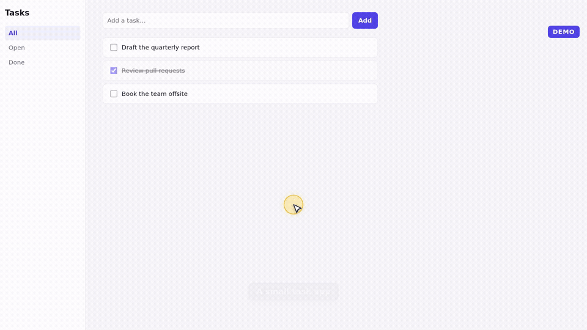

<div align="center">

# 🎬 demo-reel

### Script it. Record it. Smooth as butter.

Frame-exact **60 fps** demo videos of any web app, recorded from a short script —
cursor halo, click ripples, captions, before/after badges. One MP4 that loops in PowerPoint, Keynote or on the web.

<br/>



<sub>The bundled example — <code>examples/tasks.scenario.mjs</code>, 17 s at 60 fps (<a href="docs/example.mp4">MP4</a>).</sub>

<br/><br/>

[](https://agentskills.io)&nbsp;
[](LICENSE)

</div>

## Why

Screen recordings of web apps usually stutter: the recorder grabs whatever the browser managed to paint, so a heavy page or a slow laptop gives you 10–15 fps. Re-recording until it looks OK is slow, and every take is different.

demo-reel drives your **real app** in headless Chromium on a **virtual clock**. Animation frames, `performance.now`, `Date` and every CSS animation advance exactly 1/60 s per frame, then the frame is captured. However long rendering takes, the video plays back perfectly smooth — and the same script gives the same video every time.

## What you get

- 🖱️ **A cursor people can follow** — big arrow, yellow halo, ripple on every click
- 💬 **Captions and badges** that survive page navigations (`BEFORE` / `AFTER`, `NEW`…)
- 🎞️ **Exact timing** — a 1.5 s hold is 90 frames, always; loading screens are skipped, not recorded
- 🧊 **WebGL / three.js / canvas** apps work (software rendering, still frame-exact)
- 📦 **H.264 MP4, yuv420p** — plays and loops in PowerPoint and Keynote without conversion
- 🧪 **A QA contact sheet** to check a take at a glance

## Quick start

Needs Node 18+ and ffmpeg.

```bash
git clone https://github.com/hasuwini77/demo-reel
cd demo-reel/skills/demo-reel
npm install && npx playwright install chromium
node scripts/record.mjs examples/tasks.scenario.mjs --out tasks.mp4
scripts/sheet.sh tasks.mp4          # contact sheet for a quick look
```

## A scenario

```js
export default {
  size: "1920x1080",
  async run(d) {
    await d.open("http://localhost:4173/");
    d.badge("NEW", "#15803d");
    d.caption("One place for every filter");
    await d.click(d.page.getByRole("button", { name: "Filters" }));
    await d.hold(1500);
    await d.type("Stockholm");
    await d.press("Enter");
    d.caption("Results update as you type");
    await d.hold(2000);
  },
};
```

The full API — `open`, `hold`, `settle`, `move`, `click`, `type`, `press`, `scroll`, `caption`, `badge`, `step` — plus tips for canvas UIs, before/after videos and troubleshooting is in [`skills/demo-reel/SKILL.md`](skills/demo-reel/SKILL.md).

## Use it as an agent skill

demo-reel is an [Agent Skill](https://agentskills.io): your coding agent writes the scenario, records, checks the contact sheet and hands you the MP4.

**Claude Code**

```
/plugin marketplace add hasuwini77/demo-reel
/plugin install demo-reel@demo-reel
```

Or copy `skills/demo-reel` into `~/.claude/skills/`. Then ask: *"make a 45-second demo video of the new onboarding flow"*.

Other agents that read `SKILL.md` folders (Cursor, Codex, Gemini CLI, Copilot…) can use the same directory.

## How it works

```
scenario.mjs ──► Playwright (headless Chromium)
                   │  inject.js: virtual clock + overlay (cursor, captions)
                   │
                   └─ per frame: tick 1/60 s → step rAF + CSS animations → screenshot
                                                                       │
                                                           ffmpeg (H.264, 60 fps) ──► demo.mp4
```

Timers (`setTimeout`) intentionally stay real: faking them makes zero-delay loader and scheduler loops spin forever — which is also why Playwright's built-in fake clock can hang on WebGL-heavy pages.

## Roadmap

- [ ] Zoom / pan-to-focus on a region
- [ ] Keyboard-shortcut overlay (show `⌘K` when pressed)
- [ ] Title and end cards
- [ ] Audio track / voice-over from captions
- [ ] Auto-trim idle stretches

Ideas and PRs welcome.

## License

[MIT](LICENSE)
